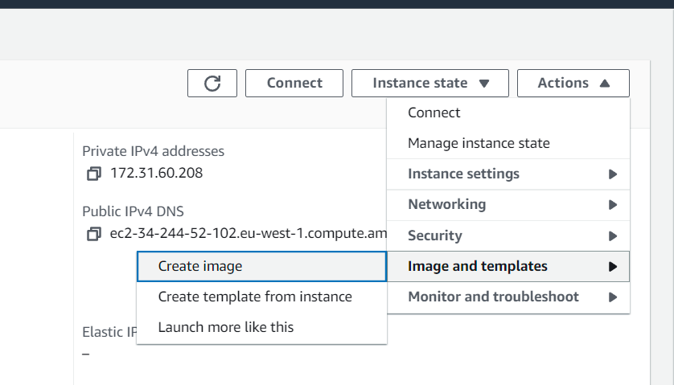
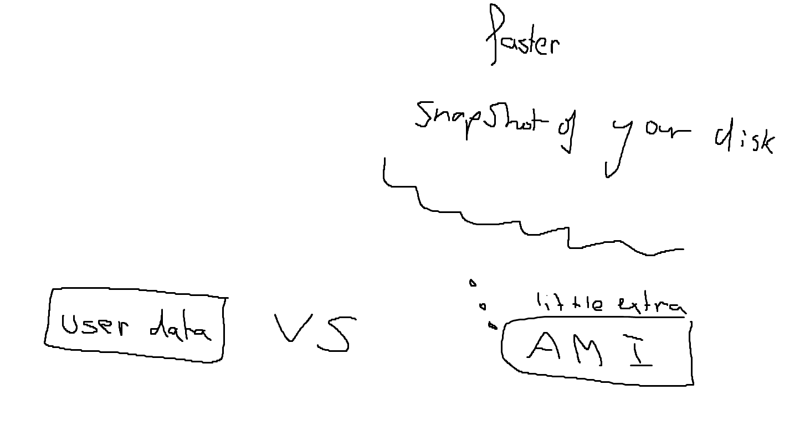
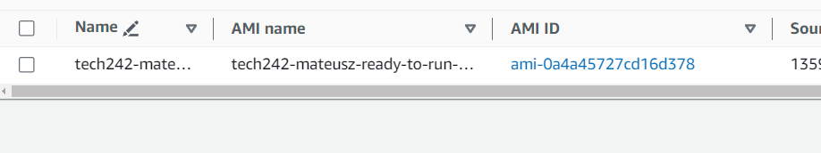
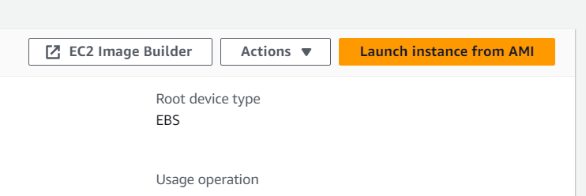

## create ami from running working instance

## ami is faster
## ami is created from a snapshot of the ec2 instance
## 8gb of ram 8gn snapshot
## you can create ec2 from ami

## when creating ami remeber to ad name tag at bottom
## to create instance buttun is top right
