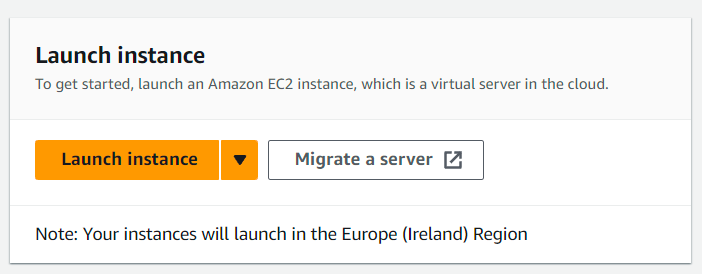
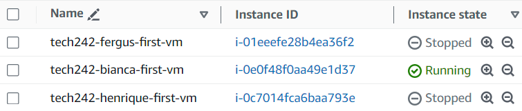

# Getting aws set up

## log into asw using your credentials

## go into ec2 in frequently accessed from dash

## you can create a new one (launch instance) in EC2

## you can create a new one (launch instance) in EC2

## the settings:
### create name in hte form tech242-name-what
### for security set up ssh only for your ip and http from anywhere
### set up tech242 for the key pair
### set up type t2.micro

## get he tech242.pem (already set up)

## use the command with hte correct tech242.pem in .ssh

## remember the Ip address has to change everytime you restart

## you can check if yours is still on in the instance tab

