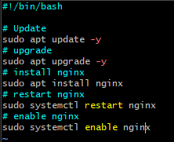
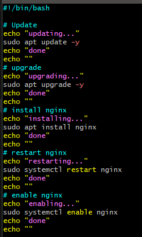

# Making a bash scrip
## a bash script is an ordered set of linux commands to be run

## the bash script always srats with the part at the top which says what is used to run the script
## sudo runs as super users, su(-per)do 
## systemctl is system control

## if it runs an new machiens its idempotent, it runs on a fresh machine, it runs on a fresh machine

