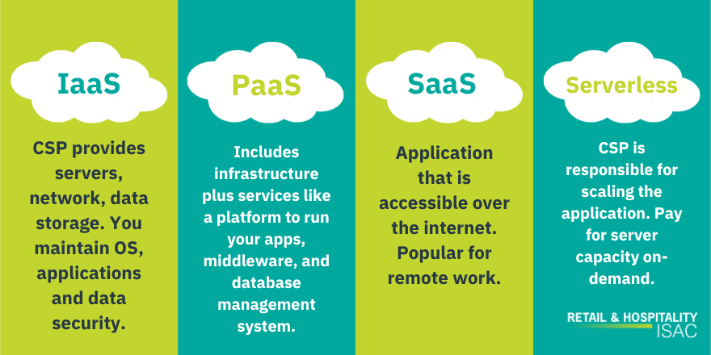
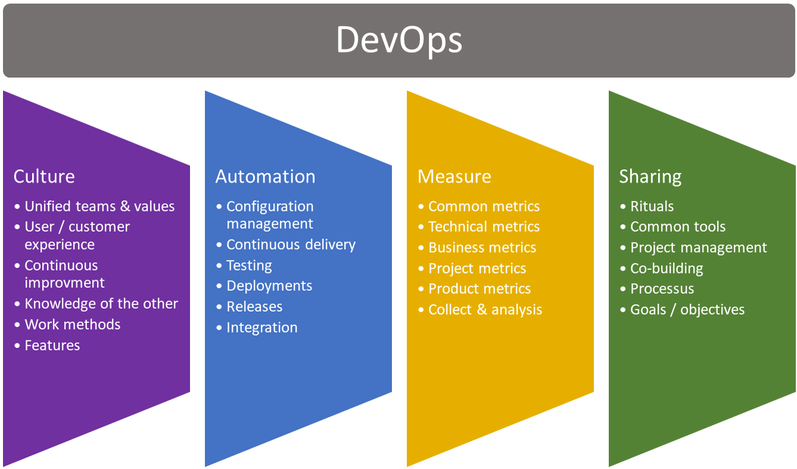
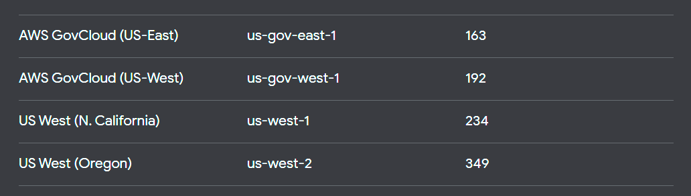

# Cloud
[cloud document](cloud.md)
- cloud is a technoglogy that allows users to host information on the internet.
- It consists of technologies such as servers and databases.
- Access it from anywhere
- IoT
- virtual servers pay as you go and as a service business model.
- hostsed online

## models

## example of moving
an example of things movign to cloud is games, games used to be cartages and cd's. These days new games are almost exclusivley hosted online. 

## dev ops market share
Dev ops is worth 6 Billion. in terms of market share aorund 20% is expected by 2030

## dev ops pillars
 

# AWS 
[aws document](aws.md)
- aws, azure and google are all cloud services.
- they alow you to use the cloud, host your data online.

## points of presence

