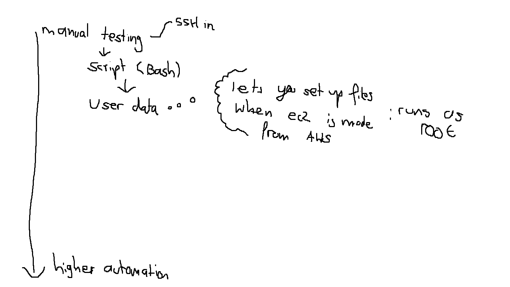
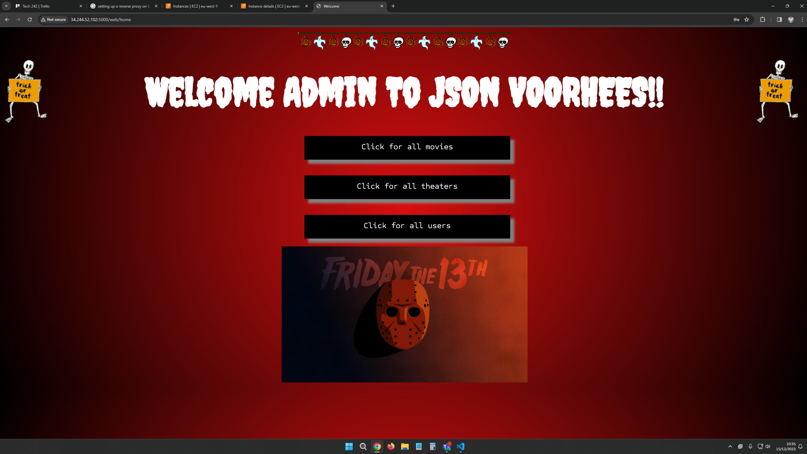

## end of git clone you can specify to put it into a folder called repo
## git clone .... repo
## better code
```
#!/bin/bash

# update
echo "updating ..."
sudo apt update -y
echo "done"
echo ""
# upgrade
echo "upgrading..."
sudo DEBIAN_FRONTEND=noninteractive apt upgrade -y
echo "done"
echo ""
# install maven
echo "installing maven..."
sudo DEBIAN_FRONTEND=noninteractive apt install maven -y
echo "done"
echo ""
# check maven
echo "checking maven..."
mvn -version
echo "done"
echo ""
# install JDK java 17
echo "installing java 17..."
sudo DEBIAN_FRONTEND=noninteractive apt install openjdk-17-jdk -y
echo "done"
echo ""
# check JDK 17
echo "checking java 17..."
java -version
javac -version
echo "done"
echo ""
# install git
echo "installing git..."
sudo DEBIAN_FRONTEND=noninteractive apt install git -y
echo "done"
echo ""
# check git
echo "checking git..."
git --version
echo "done"
echo ""
# git clone repo
echo "cloning repo..."
git clone https://github.com/Piasttorun/tech242-jsonvoorhees-app ~/repo
echo "done"
echo ""
## run
echo "running..."
cd ~/repo/springapi/
mvn spring-boot:start
echo "done"
echo ""
```


## it worked
## to add user data you need to go to more settign at the bottom when creating a  vm and then pate the code of the script into that area.