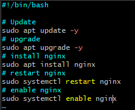
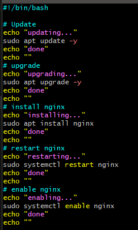
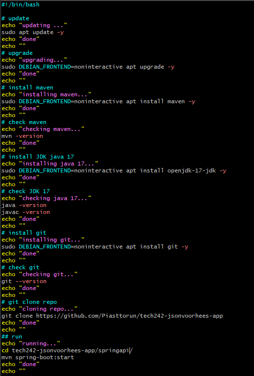

# Making a bash script
## a bash script is an ordered set of linux commands to be run

## the bash script always srats with the part at the top which says what is used to run the script
## sudo runs as super users, su(-per)do 
## systemctl is system control

## if it runs an new machiens its idempotent, it runs on a fresh machine, it runs on a fresh machine


## environment varaibles are oftne used to hold senstive data, our java rpograms will access data from those environment variables.

## how to sort out kernel user interaction, bad for automation
## despite having -y in commnd
## maven also asks about user input
### to bypass user input DEBIAN_FRONTEND=noninteractive
## scp -i ~/.ssh/tech242.pem ~/Documents/sendthisover.txt ubuntu@ec2-34-241-219-7.eu-west-1.compute.amazonaws.com:~
##


```
#!/bin/bash

# update
echo "updating ..."
sudo apt update -y
echo "done"
echo ""
# upgrade
echo "upgrading..."
sudo DEBIAN_FRONTEND=noninteractive apt upgrade -y
echo "done"
echo ""
# install maven
echo "installing maven..."
sudo DEBIAN_FRONTEND=noninteractive apt install maven -y
echo "done"
echo ""
# check maven
echo "checking maven..."
mvn -version
echo "done"
echo ""
# install JDK java 17
echo "installing java 17..."
sudo DEBIAN_FRONTEND=noninteractive apt install openjdk-17-jdk -y
echo "done"
echo ""
# check JDK 17
echo "checking java 17..."
java -version
javac -version
echo "done"
echo ""
# install git
echo "installing git..."
sudo DEBIAN_FRONTEND=noninteractive apt install git -y
echo "done"
echo ""
# check git
echo "checking git..."
git --version
echo "done"
echo ""
# git clone repo
echo "cloning repo..."
cd ~
git clone https://github.com/Piasttorun/tech242-jsonvoorhees-app repo
echo "done"
echo ""
## run
echo "running..."
cd ~/repo/springapi/
mvn spring-boot:start
echo "done"
echo ""

echo "proxy setting up"
# Define variables
DOMAIN=$(curl ifconfig.me)
TARGET_IP=$(curl ifconfig.me)
TARGET_PORT="5000"


# Install Apache
sudo DEBIAN_FRONTEND=noninteractive apt install apache2 -y

# Enable necessary Apache modules
sudo a2enmod proxy
sudo a2enmod proxy_http
sudo a2enmod proxy_balancer
sudo a2enmod lbmethod_byrequests

# Create a virtual host configuration file
sudo tee /etc/apache2/sites-available/reverse-proxy.conf > /dev/null <<EOL
<VirtualHost *:80>
    ServerName $DOMAIN

    ProxyPreserveHost On
    ProxyPass / http://$TARGET_IP:$TARGET_PORT/
    ProxyPassReverse / http://$TARGET_IP:$TARGET_PORT/

    ErrorLog \${APACHE_LOG_DIR}/error.log
    CustomLog \${APACHE_LOG_DIR}/access.log combined
</VirtualHost>
EOL

# Enable the virtual host
sudo a2ensite reverse-proxy

# Reload Apache to apply changes
sudo systemctl reload apache2
echo "done"
echo ""
```
## To explain this code it updates, DEBIAN_FRONTEND disallows the output of a new window
## we always check --versions for debuging reasons
## this code made a working repo
## code updated to work with apache reverse proxy