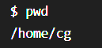
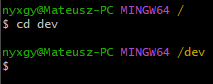
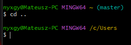
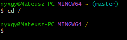
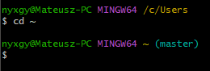
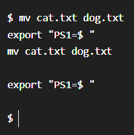
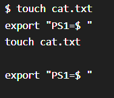
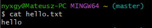
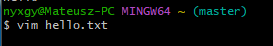
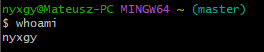

#### commands
## PWD
### output name of currect directory

## RM
### deletes file or directory

## CD
### move to specified branch

## ..
### goes to parent directory

## /
### root

## ~
### home

## MV
### move or rename

## touch
### creates an empty file

## cat
### reads files

## vim / nano
### test editor (I use VIM) press I to insert, then ESC, folowed by :wq! to write and exit file

## whoami
### output current user
