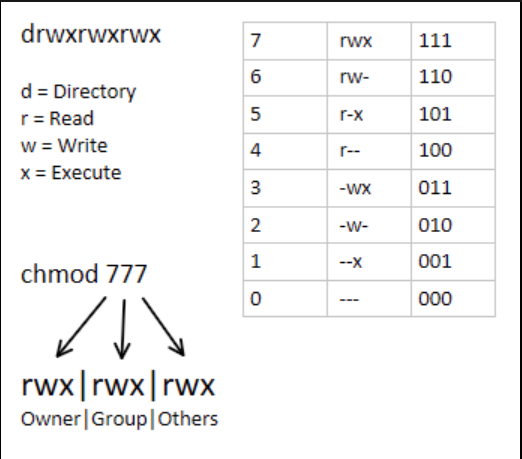
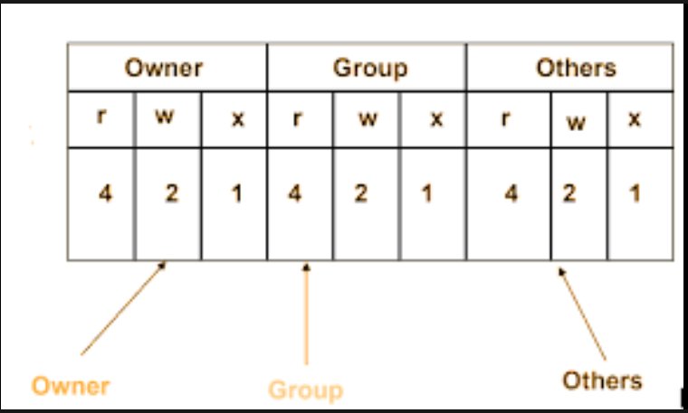

# permissions
## all files have permsiions
## files have default permsiions
## check permissions ls -a
## to change ther are many options 7 is the code for all 0 is for none
## chmod changes permissioons
## rwx and ugo
## read write execute , user group others
## u+x adds execute permsissions to a user so chmod u+x
## u-x would take them away again
## you may need to sudo chmod if its a sudo file
## thsi may be dangerous
## codes with nubers are quicker
## chmod 700 will change a file to -rwx------
## its a 3 bit 3 set number (4-2-1)(4-2-1)(4-2-1)

