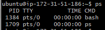

# processes
## processes are things that are stored in system memory
## user processes are run by the user, a system process is rnning to maintian the operation fo the system.
## systyem processesdo not ahve a UI and thigns like that, they provide drivers, logging, file services and they are a midddle man
## they run hte system

## system processes wont be linked to a PS sesion command
## ps aux shows a lot of information
## sleep <int> sleeps for a couple seconds
## sleep <int> & does it in the background
## jobs shows job
## kill termiantes a processs
### only kill when you know what you are doing, you made hte process you cannot termiante it another way so you have to kill it.
### kill, kill -9 <process id>, brute force kill
### a process can start another process, hteare child processes, beasue of this you man have to kill recursively, this can cause amny problems.
### zombie programs, the -9 kill can kill parents and the childen will remain doing nothing.
### thsi is why kill -9 brute force is dangerous.